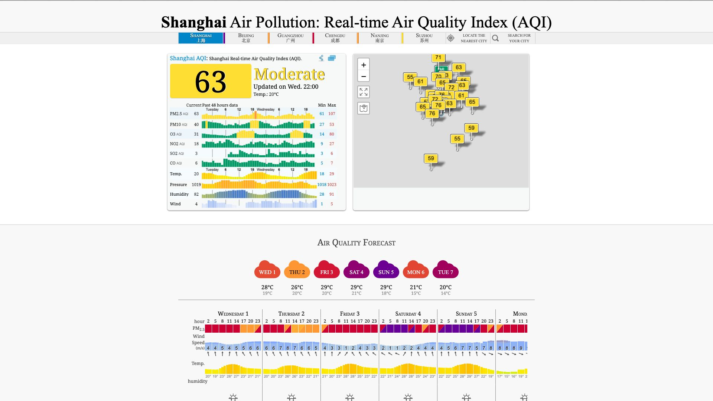

# aqicn-screenshot
Take screenshot of the aqicn website

## Install

```bash
git clone https://github.com/agreatfool/aqicn-screenshot.git
cd aqicn-screenshot
npm install
npm run build
```

## How to use

```bash
aqicn-screenshot
```

It will generate an output at `~/Downloads/YYYY-MM-DD_HH-mm-ss.jpg`



## Cronjob

Everyday 23:20, run it in headless mode

```bash
crontab -e
```

```bash
20 23 * * * export PUPPETEER_SKIP_CHROMIUM_DOWNLOAD=true && export PUPPETEER_EXECUTABLE_PATH=/opt/homebrew/bin/chromium && /Users/jonathan/.nvm/versions/node/v18.16.1/bin/node /Users/jonathan/.nvm/versions/node/v18.16.1/lib/node_modules/aqicn-screenshot/dist/index.js >/tmp/stdout.log 2>/tmp/stderr.log
```

## Log

```bash
/tmp/stderr.log
/tmp/stdout.log
```
